# Getting Started
Welcome to the basic development guide for [OS2-PROJECTNAME].

This guide will help you set up a controlled, isolated development environment using the projects pre-built containers. 
By following these steps, you can develop locally or in a managed service like GitHub Codespaces without worrying about conflicts with other software or system libraries.

## Application architecture

```mermaid
flowchart LR
 subgraph Infrastructure["Infrastructure"]
        P("Reverse Proxy")
        O{{"🔎  Observability"}}
        S[("Storage")]
        A("🛡️ Authentication")
  end
 subgraph Application["Application"]
        BE("Backend / API")
        FE("Frontend")
  end
    B(["👤 Browser"]) --> P
    P --> FE & BE
    FE <--> BE & A
    BE --> S
    BE -- metrics --> O
    FE -- metrics --> O
    style O color:#424242,fill:#FFE0B2
    style A fill:#BBDEFB,color:#424242
    style B stroke:#FFFFFF,fill:#C8E6C9,color:#424242


```



## 💻 Development

### Requirements
To set up a containerized development and test environment on a local computer or in a hosted developer enviroment a container runtime enviroment is needed.

---


## Development

To spin up the project, simply install docker-compose and then run the following 
commands:

```
$ git clone https://github.com/docker/getting-started-app
$ cd getting-started-app
$ docker compose up -d
```

You'll see several container images get downloaded from Docker Hub and, after a
moment, the application will be up and running! No need to install or configure
anything on your machine!

Simply open to [http://localhost](http://localhost) to see the app up and running!

Any changes made to either the backend or frontend should be seen immediately
without needing to rebuild or restart the containers.

To help with the database, the development stack also includes phpMyAdmin, which
can be access at [http://db.localhost](http://db.localhost) (most browsers will 
resolve `*.localhost` correctly, so no hosts file changes should be required).

### Tearing it down

When you're done, simply remove the containers by running the following command:

```
$ docker compose down
```